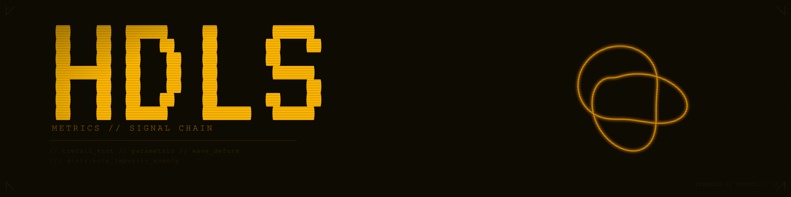

<p align="center">
  
</p>

---

> A signal chain research collective. We preserve vanishing knowledge with
> dr3dg3-n3t, build local AI tools with synapse-engine and myc3lium, and keep
> smaller models viable in the field. Everything runs on hardware we own.

---

## Flagship Projects

<table>
  <tr>
    <td width="33%" valign="top">
      <h3 align="center"><a href="https://github.com/dlorp/synapse-engine">synapse-engine</a></h3>
      <p align="center">
        <br/>
        <br/>
        <br/>
        
      </p>
      <p align="center">
        LLM workshop: load, benchmark, finetune, and abliterate local models. Modular prototype system where each stage of the model lifecycle is a separate, swappable component. Built to make smaller models viable in the field.
      </p>
    </td>
    <td width="33%" valign="top">
      <h3 align="center"><a href="https://github.com/dlorp/myc3lium">myc3lium</a></h3>
      <p align="center">
        <br/>
        <br/>
        <br/>
        
      </p>
      <p align="center">
        FastAPI bridge between Reticulum mesh networking and Meshtastic LoRa. Runs on ESP32 for low-power field deployment. Named after the underground network of fungal mycelium.
      </p>
    </td>
    <td width="33%" valign="top">
      <h3 align="center"><a href="https://github.com/dlorp/dr3dg3-n3t">dr3dg3-n3t</a></h3>
      <p align="center">
        <br/>
        <br/>
        <br/>
        
      </p>
      <p align="center">
        Offline internet — a "Web 3.0 Whole Earth Catalog" for preserving knowledge that matters. Curated snapshots of vanishing sources, structured for browsing without a connection.
      </p>
    </td>
  </tr>
</table>

---

## Other Projects

| Project | Description | Stack | Status |
|---------|-------------|-------|--------|
| [r3LAY](https://github.com/dlorp/r3LAY) | Local-first research terminal for hobbyists — maintenance logging, natural language input, RAG search across your docs | Python \| Shell |  |
| [phase-engine](https://github.com/dlorp/phase-engine) | Circadian awareness tool for Sensor Watch — four natural phases, intelligent feedback. Bangle.js 2 for testing, f91W custom firmware is the target | C \| C++ \| Python |  |
| [t3rra1n](https://github.com/dlorp/t3rra1n) | Terminal UI that doubles as an immersive ARG — field reports from a stranded HDLS researcher documenting alien landscapes | Python |  |
| [heedless.net](https://github.com/dlorp/heedless.net) | HDLS domain — public-facing site | HTML |  |
| [knowledge-vault](https://github.com/dlorp/knowledge-vault) | 3000+ entries across 62 domains — the collective memory | Markdown |  |
| [vault-crawler](https://github.com/dlorp/vault-crawler) | Automated source intake for the knowledge vault | Python |  |

---

## What We Do

```
preserve                 build                   research
   |                       |                       |
dr3dg3-n3t            synapse-engine          small LLMs
offline internet      model workshop          in the field
   |                       |                       |
   +-----------+-----------+-----------+-----------+
               |
            HDLS lab
     hardware we own
     no cloud, no keys
```

---

## Metrics

<p>
  
  
  
  
</p>

---

<p align="center">
  
</p>
