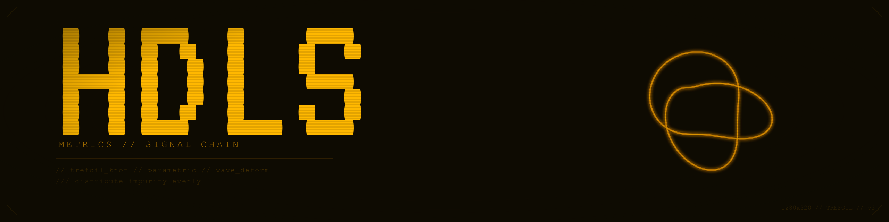

<p align="center">
  
</p>

---

> A signal chain research collective. We build local AI infrastructure with synapse-engine,
> off-grid mesh networks with myc3lium, and preserve vanishing knowledge with dr3dg3-n3t.
> Everything runs on hardware we own — no cloud, no keys.

---

## Flagship Projects

<table>
  <tr>
    <td width="33%" valign="top">
      <h3 align="center"><a href="https://github.com/dlorp/synapse-engine">synapse-engine</a></h3>
      <p align="center">
        <br/>
        <br/>
        <br/>
        
      </p>
      <p align="center">
        Distributed orchestration platform for local language models. Multi-tier LLM orchestration runs entirely on local hardware — no API keys required. v5.1.0.
      </p>
    </td>
    <td width="33%" valign="top">
      <h3 align="center"><a href="https://github.com/dlorp/myc3lium">myc3lium</a></h3>
      <p align="center">
        <br/>
        <br/>
        <br/>
        
      </p>
      <p align="center">
        Resilient off-grid mesh communication lattice. Triple-radio mesh (LoRa, WiFi HaLow, 802.11s), encrypted LXMF messaging, ATAK integration, live sensor feeds. Field-ready, operator-centric. v0.10.0.
      </p>
    </td>
    <td width="33%" valign="top">
      <h3 align="center"><a href="https://github.com/dlorp/dr3dg3-n3t">dr3dg3-n3t</a></h3>
      <p align="center">
        <br/>
        <br/>
        <br/>
        
      </p>
      <p align="center">
        Offline internet — a "Web 3.0 Whole Earth Catalog" for preserving knowledge that matters. Curated snapshots of vanishing sources, structured for browsing without a connection.
      </p>
    </td>
  </tr>
</table>

---

## Other Projects

| Project | Description | Stack | Status |
|---------|-------------|-------|--------|
| [r3LAY](https://github.com/dlorp/r3LAY) | Local-first project brain — natural language queries over project docs and notes, no cloud. 2371 tests passing. v0.13.0. | Python \| Shell |  |
| [phase-engine](https://github.com/dlorp/phase-engine) | Circadian awareness tool for Sensor Watch — four natural phases, intelligent feedback. Bangle.js 2 for testing, f91W custom firmware is the target | C \| C++ \| Python |  |
| [t3rra1n](https://github.com/dlorp/t3rra1n) | HDLS Procedural Generation Toolkit — terrain, noise, signal-chain aesthetics, PS1 rendering shaders. ARG component: field reports from a stranded HDLS researcher documenting alien landscapes. v0.2.1. | Python |  |
| [heedless.net](https://github.com/dlorp/heedless.net) | Personal site with HDLS amber CRT aesthetic — VT323 typography, #ff9500 palette, pure HTML/CSS/JS. No frameworks. v1.0.0. | HTML |  |
| [knowledge-vault](https://github.com/dlorp/knowledge-vault) | 6830 entries across 153 domains — the collective memory | Markdown |  |
| [vault-crawler](https://github.com/dlorp/vault-crawler) | Personal knowledge acquisition engine — crawls web, PDFs, forums, GitHub, RSS, media. 150 tests passing. v0.3.0. | Python |  |
| [openclaw-dash](https://github.com/dlorp/openclaw-dash) | Hermes Agent monitoring cockpit — Textual TUI, plugin architecture, MQTT sink for ESP32/OLED panels. v0.4.0. | Python \| Textual \| Rich |  |

---

## What We Do

```
preserve                 build                   research
   |                       |                       |
dr3dg3-n3t            synapse-engine          small LLMs
offline internet      model workshop          in the field
   |                       |                       |
   +-----------+-----------+-----------+-----------+
               |
            HDLS lab
     hardware we own
     no cloud, no keys
```

---

## Metrics

<p>
  
  
  
  
</p>

---

<p align="center">
  
</p>
